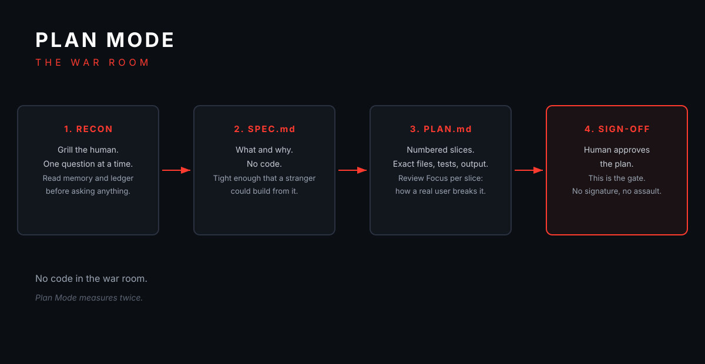
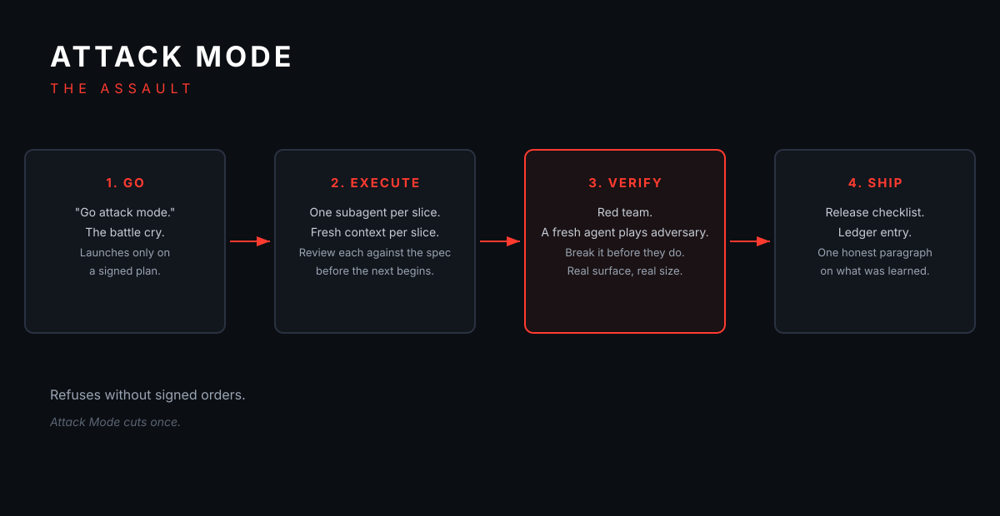

# TGL (Touch Grass Later)

*Plan Mode measures twice. Attack Mode cuts once.*

TGL is a developer harness for Muse agents: an AI-native, spec-driven way
to turn an AI coding agent from improviser into a disciplined build team.
Agents are powerful but improvisational: brilliant one turn, sloppy the next.
TGL makes disciplined development the default.

## Quick start

Point your Muse agent at this repo and say **"run TGL"** (or load
`SKILL.md` into its context). Then:

- **"TGL, plan X"** enters Plan Mode: your agent grills you one question at
  a time, writes a spec and a sliced plan, and waits for your sign-off. No
  code yet.
- **"go attack mode"** launches Attack Mode: your agent executes the signed
  plan one slice at a time, reviews each slice against the spec, red-teams
  the build, and ships.

## The two modes

**Plan Mode: the war room.** Recon (one question at a time, always as
tappable choices, and your agent reads the project memory first so it never
re-asks a settled question), SPEC.md (what and why, no code), PLAN.md
(numbered slices with exact files, interfaces, tests, commands, expected
output, and a Review Focus per slice). Nothing is built until you sign the
plan.

**Attack Mode: the assault.** One subagent per slice, each with fresh
context. The commanding agent reviews each slice against the spec before the
next begins, and sends you a SITREP at every boundary so the build never
goes quiet. Then a fresh agent plays red team and attacks the build the way
a real user would. Red team creed: break it before they do.

**The chain of command between them:** Attack Mode does not march without
signed orders. No approved plan, no assault. It is the only enforcement
mechanism, and it is absolute.

| Without TGL | With TGL |
|---|---|
| One-shot builds, silent for an hour | Sliced execution with a SITREP at every boundary |
| "It works on my machine" | Verified in the real surface at real size |
| Bugs found by users | Bugs found by your own red team first |
| Context lost between sessions | LEDGER.md remembers every decision |

## Installation

Two ways in, pick whichever feels right.

**Conversational (the Muse-native way).** Point your Muse agent at this repo
and say **"install TGL"**. It reads the skill, walks you through setup step
by step, explains what each mode does, and runs the first-run tutorial with
you. No terminal required.

**TUI installer.** Run `python3 install/tgl-install.py` in a terminal. It is
stdlib-only Python, so it works over the plainest SSH connection:

- Shows you what TGL is and how the two modes work
- Checks the environment, then copies the skill into your Muse skills folder
- Verifies the install by reading it back (never trust a build report)
- Offers the guided first run

Every step has a help tooltip: press `h` at any prompt.
Flags: `--yes` to skip pauses, `--no-color` for plain output,
`--target DIR` to choose the install location.

After either path, two phrases run everything: **"TGL, plan X"** and
**"go attack mode."**

## Learn it

- [docs/tutorial.md](docs/tutorial.md): guided first run on a tiny example
  project. Shows exactly what you type and see, including what a SITREP
  looks like when a build checks in.
- [docs/modes.md](docs/modes.md): Plan Mode vs Attack Mode deep dive, the
  chain-of-command gate, and what red-team verification catches.

## Repo layout

- `SKILL.md`: the harness itself. This is the product.
- `install/tgl-install.py`: the TUI installer.
- `templates/`: SPEC, PLAN, and LEDGER templates plus the release checklist.
- `docs/`: the tutorial and the modes deep dive.
- `assets/branding/`: logo, repo banner, and mode diagrams.

## Built for every developer

TGL is not one person's workflow written down. The stranger test is a
standing rule: if something only works on one person's machine, it does not
ship. No hardcoded identity, no assumed tooling, no assumed memory system.
Built connector-ready: clean packaging, separable concerns.

## Why it exists

Muse agents needed the disciplines that already work elsewhere: GSD's phase
isolation, Superpowers' spec-before-code, sliced review, and persistent
ledger. Rebuilt for how agents actually work: subagents instead of git
worktrees, the spec file instead of hooks, real-surface verification instead
of build reports, SITREPs instead of silence.

In private dogfood now, getting bloodied on real builds.

## License

MIT. See [LICENSE](LICENSE).
